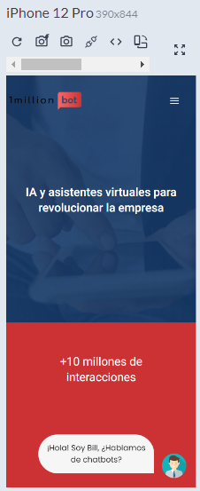
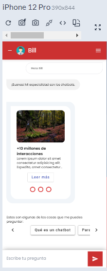
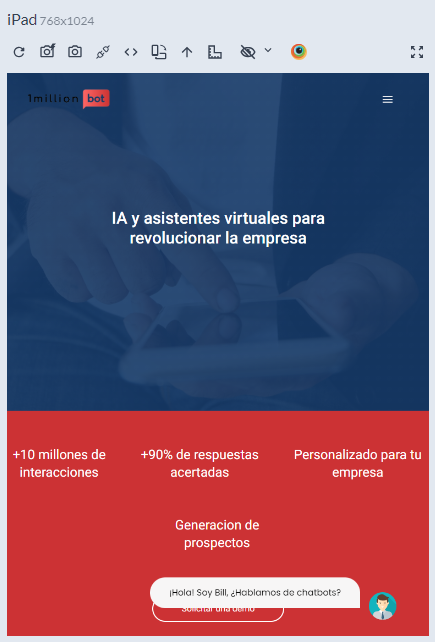
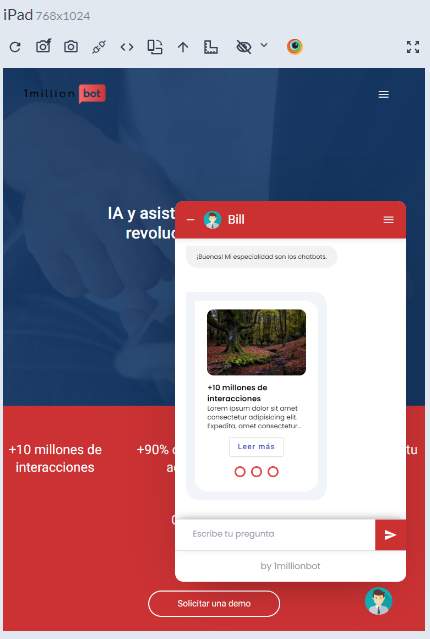
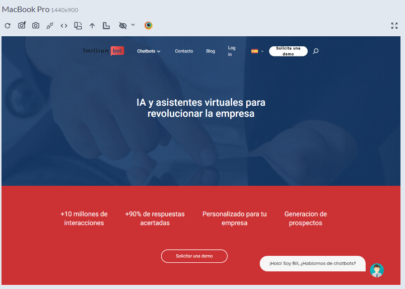
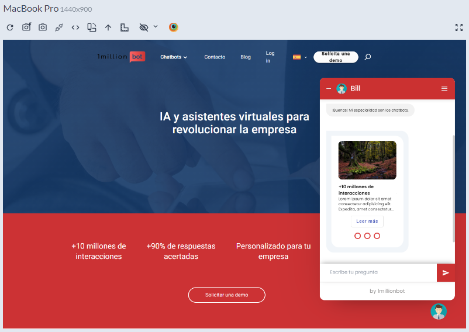

# Proyecto 1millionbot

## Comando para iniciar el proyecto

```docker
docker-compose -f docker-compose.yml up
```

### Diseño Responsive

El aplicativo es complemtamente responsive, se puede ver en varios dispositivos de la siguiente forma:

### Página Principal en móvil



### Chatbot en móvil



### Página Principal en tablet



### Chatbot en tablet



### Página Principal en ordenador



### Chatbot en ordenador


